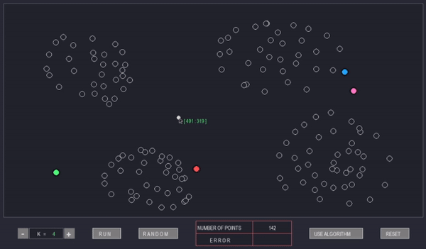
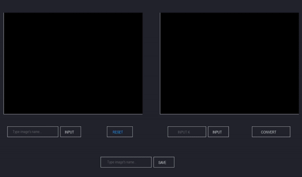

# Preview
## Kmeans Algorithm GUI

  

## Image Compression with Kmeans Algorithm

<a href = "https://github.com/hoangndst/kmeans-img-compression/wiki" target = "_blank">
Check out WIKI
</a>

2020 @ arch-techs

## Contributing
Pull requests are welcome. For major changes, please open an issue first to discuss what you would like to change.

Please make sure to update tests as appropriate.

## License
[MIT](https://choosealicense.com/licenses/mit/)
